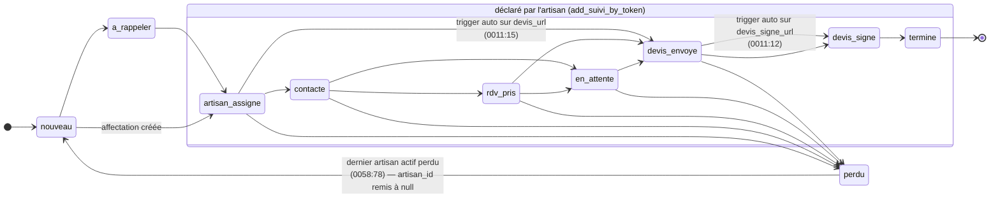

# A3 — Logique métier & intégrité des données

> Audit du 2026-08-03 · périmètre : règles de commission, montants, machine à états, affectations multi-artisans, automatisations cron, purge.
> Tout est vérifié dans le code. Ce qui dépend des données réellement en base est marqué **« à confirmer sur les données de prod »** et mesurable via `audit/verification-prod.sql`.

## Résumé

| Sévérité | Nombre |
|---|---|
| CRITIQUE | 2 |
| ÉLEVÉ | 4 |
| MOYEN | 4 |
| FAIBLE | 2 |

Les trois plus graves :

1. **Le taux de commission signé au contrat n'est jamais appliqué à la facturation.** Un artisan recruté à 15 % signe un contrat qui dit 15 %, mais tous ses chantiers calculent 10 %. L'écart est silencieux et permanent.
2. **Le montant du devis signé déposé par l'artisan n'atteint la commission que si l'artisan déclare aussi un changement de statut.** S'il dépose son devis sans cliquer sur « devis signé », la commission reste à 0 € dans le CRM.
3. Un projet dont tous les artisans abandonnent **repart à `nouveau` en conservant son ancien `montant_devis_signe`**, donc une commission fantôme au tableau de bord.

Point solide et à préserver : **la commission est bien une colonne générée par la base** (`generated always as … stored`), jamais recalculée dans le front. L'architecture est la bonne ; ce sont ses entrées qui sont mal alimentées.

---

## La chaîne de la commission, telle qu'elle est réellement câblée

C'est la clé de lecture de tout ce document. Trois valeurs interviennent, et elles ne vivent pas au même endroit :

```
artisans.taux_commission   ──► sert UNIQUEMENT à écrire le texte du contrat
  (0.05 … 0.30)                (0055_contrat_taux_dynamique.sql:80)
                                      ✗ aucun lien
projets.taux_commission    ──► sert au CALCUL de la commission
  (défaut 0.10, saisi à la main)

affectations.montant_devis_signe ──► saisi par l'ARTISAN (set_montant_by_token)
        │
        │  synchronisé UNIQUEMENT par add_suivi_by_token(p_statut='devis_signe')
        ▼
projets.montant_devis_signe

projets.commission = coalesce(montant_devis_signe,0) * coalesce(taux_commission,0.10)   [colonne générée]
```

Deux ruptures dans cette chaîne : la flèche barrée (A3-01) et la synchronisation conditionnelle (A3-02).

---

## Machine à états reconstituée

Dix statuts sont déclarés (`src/lib/constants.ts:155-183`). Ils vivent en parallèle sur `projets.statut` et sur `affectations.statut`, le second pilotant le premier.



Trois mécanismes écrivent `projets.statut`, sans se coordonner :

| Mécanisme | Où | Règle |
|---|---|---|
| Saisie manuelle par l'associé | `projet-form.tsx`, kanban | libre, aucune transition interdite |
| Trigger `auto_statut_sur_devis` | `0011:9-23` | `devis_signe_url` renseigné → `devis_signe` (sauf si `perdu`) ; `devis_url` renseigné → `devis_envoye` (seulement depuis `nouveau`/`artisan_assigne`) |
| `add_suivi_by_token` | `0058:54-86` | dérive `projets.statut` du **meilleur** statut parmi les affectations non perdues |

**Aucune contrainte SQL ne restreint les transitions** : `projets.statut` est une colonne `text` sans `check`. N'importe quelle valeur, y compris inconnue, peut y être écrite.

---

### [CRITIQUE] A3-01 — Le taux du contrat signé n'est jamais appliqué aux chantiers

**Où** : `0008_societe_taux.sql:13,17,23` · `0055_contrat_taux_dynamique.sql:80` · `0053_zones_multiples.sql:143` · `src/features/projets/components/projet-form.tsx:104` · `src/features/projets/components/quick-prospect-dialog.tsx:66`

**Constat** : il existe **deux colonnes `taux_commission` distinctes**, sur `artisans` et sur `projets`, toutes deux à `0.10` par défaut (`0008:13` et `0008:17`).

Le texte du contrat d'engagement est généré à partir du taux de **l'artisan** :

```sql
-- 0055_contrat_taux_dynamique.sql:80
… une commission égale à … || round(coalesce(a.taux_commission, 0.10) * 100)::text || … %
```

Mais la commission facturée est calculée à partir du taux du **projet** :

```sql
-- 0008_societe_taux.sql:23
commission numeric generated always as
  (coalesce(montant_devis_signe, 0) * coalesce(taux_commission, 0.10)) stored;
```

J'ai tracé toutes les écritures de `projets.taux_commission` dans le dépôt. Il y en a exactement trois : le `default 0.10` de la colonne, `projet-form.tsx:104` (`projet?.taux_commission ?? 0.1`), `quick-prospect-dialog.tsx:66` (`taux_commission: 0.1` en dur), plus la saisie manuelle de `montants-card.tsx:50`. **Aucune ne lit `artisans.taux_commission`.** Il n'existe ni trigger, ni fonction, ni code front qui propage le taux de l'artisan vers ses projets — y compris au moment de l'affectation.

**Impact** : dès qu'un artisan est recruté à un taux différent de 10 %, le CRM et le contrat divergent définitivement.

- Artisan recruté via `/rejoindre?taux=15` : le contrat qu'il signe stipule 15 %. Le CRM facture 10 %. **Sur un devis de 20 000 €, l'agence encaisse 2 000 € au lieu de 3 000 € — 1 000 € perdus, par chantier.**
- Artisan recruté à 5 % : le contrat dit 5 %, le CRM facture 10 %. L'agence **sur-facture** de 1 000 € sur le même devis, en contradiction avec un contrat signé — c'est le sens le plus risqué juridiquement.

Rien ne signale l'écart : la fiche projet affiche le taux du projet, la page d'espace artisan affiche `p.commission` (`0060:52`), et les deux sont cohérentes entre elles. Seule une relecture du contrat révèle le problème.

**Scénario** :
1. Un artisan est démarché avec un lien `https://crm-ci7k.vercel.app/rejoindre/whatsapp?taux=15`.
2. Il remplit le formulaire → `inscrire_artisan` écrit `artisans.taux_commission = 0.15` (`0053:143`, valeur envoyée par `inscription-artisan-page.tsx:93` sous la forme `tauxPct / 100`).
3. `ensure_engagement_contrat` génère le contrat avec « 15 % » (`0055:80`). L'artisan le signe.
4. Un projet lui est affecté. `projets.taux_commission` vaut `0.10`, valeur par défaut.
5. Il dépose un devis signé de 20 000 €. `projets.commission` vaut `2 000 €`.
6. L'agence facture 2 000 € au lieu des 3 000 € contractuels.

**Correctif** — propager le taux au moment de l'affectation, qui est le moment métier correct (le taux applicable est celui de l'artisan qui réalise le chantier) :

```sql
-- 0061 : le taux du projet suit l'artisan affecté
create or replace function public.sync_taux_commission()
returns trigger language plpgsql security definer set search_path = public as $$
begin
  update public.projets p
     set taux_commission = coalesce(
           (select a.taux_commission from public.artisans a where a.id = new.artisan_id),
           p.taux_commission)
   where p.id = new.projet_id
     and p.montant_devis_signe is null;   -- ne jamais retoucher un dossier déjà facturé
  return new;
end; $$;

drop trigger if exists trg_sync_taux on public.affectations;
create trigger trg_sync_taux
  after insert on public.affectations
  for each row execute function public.sync_taux_commission();
```

Et faire de même dans `add_suivi_by_token` au passage à `devis_signe` (`0058:58-61`), qui désigne l'artisan gagnant :

```sql
update public.projets
   set artisan_id = af.artisan_id,
       statut = 'devis_signe',
       montant_devis_signe = af.montant_devis_signe,
       taux_commission = coalesce(
         (select a.taux_commission from public.artisans a where a.id = af.artisan_id),
         taux_commission)
 where id = af.projet_id;
```

**Régularisation du passé** — indispensable, et à faire en connaissance de cause. Requête de diagnostic (lecture seule) :

```sql
select p.id, p.client_nom, p.montant_devis_signe,
       p.taux_commission as taux_facture,
       a.taux_commission as taux_contrat,
       p.commission       as commission_facturee,
       p.montant_devis_signe * a.taux_commission as commission_contractuelle,
       p.montant_devis_signe * (a.taux_commission - p.taux_commission) as ecart
from public.projets p
join public.artisans a on a.id = p.artisan_id
where p.montant_devis_signe is not null
  and a.taux_commission is distinct from p.taux_commission;
```

**Effort** : M — le correctif est court, mais la régularisation des dossiers passés est une décision commerciale, pas technique.

**À confirmer sur les données de prod** : `audit/verification-prod.sql` renvoie `artisans_taux_distincts`. Si toutes les valeurs sont à `0.10`, le bug est latent et non encore réalisé — c'est le moment idéal pour le corriger. Toute valeur différente signifie que l'écart est déjà en cours.

---

### [CRITIQUE] A3-02 — Le montant du devis signé n'atteint la commission que par un chemin détourné

**Où** : `0025_rpc_affectations.sql:130-152` · `0058_perdu_remonte_reassignation.sql:54-61` · `src/features/contrats/upload-devis.tsx:35-84`

**Constat** : l'artisan saisit son montant via `set_montant_by_token`, qui écrit **uniquement sur `affectations`** :

```sql
-- 0025:145
update public.affectations set montant_devis_signe = p_montant where id = af.id;
```

Or la commission est une colonne générée sur **`projets`**. La seule synchronisation `affectations → projets` se trouve dans `add_suivi_by_token`, et elle est conditionnée au statut déclaré :

```sql
-- 0058:54-61
if p_statut = 'devis_signe' then
  update public.projets
    set artisan_id = af.artisan_id, statut = 'devis_signe',
        montant_devis_signe = af.montant_devis_signe
    where id = af.projet_id;
```

Le flux de dépôt de devis (`upload-devis.tsx:58-84`) enchaîne `uploaderDevis` → `set_devis_by_token` → `set_montant_by_token`. **Il n'appelle jamais `add_suivi_by_token`.** Déclarer le statut est une action séparée, dans un autre composant (`suivi-artisan.tsx:53`).

**Impact** : si l'artisan dépose son devis signé et saisit son montant sans penser à déclarer « devis signé » dans le suivi, alors `projets.montant_devis_signe` reste `null` et **`projets.commission` vaut 0 €**. Le tableau de bord, la page commissions et le total rapporté par artisan sous-évaluent d'autant. La commission n'est pas seulement mal calculée : elle est invisible, donc jamais réclamée.

L'ordre importe aussi. Si l'artisan déclare « devis signé » *avant* de saisir son montant, la synchronisation copie une valeur encore nulle, et rien ne la rejouera ensuite.

**Scénario** :
1. L'artisan ouvre `/artisan/:token`, section dépôt de devis signé.
2. Il téléverse le PDF. `set_devis_by_token` écrit `affectations.devis_signe_url`.
3. Il saisit 20 000 €. `set_montant_by_token` écrit `affectations.montant_devis_signe = 20000`.
4. Il ferme l'onglet, satisfait.
5. Côté CRM : `projets.montant_devis_signe` = `null`, `projets.commission` = **0 €**. Le projet n'apparaît pas dans les commissions à encaisser.

**Correctif** — supprimer la dépendance à l'ordre en synchronisant à la source, par trigger :

```sql
create or replace function public.sync_montant_affectation_projet()
returns trigger language plpgsql security definer set search_path = public as $$
begin
  if new.montant_devis_signe is distinct from old.montant_devis_signe
     and new.montant_devis_signe is not null then
    update public.projets
       set montant_devis_signe = new.montant_devis_signe,
           artisan_id = coalesce(artisan_id, new.artisan_id)
     where id = new.projet_id
       and (montant_devis_signe is null or statut <> 'devis_signe');
  end if;
  return new;
end; $$;

drop trigger if exists trg_sync_montant on public.affectations;
create trigger trg_sync_montant
  after update on public.affectations
  for each row execute function public.sync_montant_affectation_projet();
```

Le garde `statut <> 'devis_signe'` évite qu'un artisan perdant écrase le montant du gagnant.

**Effort** : S.

**À confirmer sur les données de prod** — mesure directe de l'ampleur :

```sql
select count(*) as chantiers_avec_montant_non_remonte
from public.affectations af
join public.projets p on p.id = af.projet_id
where af.montant_devis_signe is not null
  and p.montant_devis_signe is null;
```

---

### [ÉLEVÉ] A3-03 — Le taux de commission est borné côté client uniquement

**Où** : `src/features/artisans/pages/inscription-artisan-page.tsx:73,93` · `0053_zones_multiples.sql:143`

**Constat** : le front borne le taux entre 5 et 30 %, puis le convertit :

```ts
const tauxPct = Math.min(30, Math.max(5, Number(params.get('taux')) || 10))
// …
taux_commission: tauxPct / 100,
```

L'unité est correcte — le front envoie bien une fraction (0.05 à 0.30), cohérente avec le `default 0.10` de la colonne. **Il n'y a pas de bug d'unité.** En revanche, la RPC accepte la valeur sans aucun contrôle :

```sql
coalesce(nullif(p_payload->>'taux_commission','')::numeric, 0.10)
```

Ni borne, ni `check` sur la colonne (`0008:13` déclare seulement `numeric not null default 0.10`).

**Impact** : la clé `anon` étant publique, un artisan un peu curieux — ou toute personne à qui il transmet le lien — peut appeler la RPC directement et s'inscrire avec `taux_commission: 0`. Son contrat stipulera alors « 0 % » (`0055:80` génère le texte depuis cette valeur), et il sera parfaitement fondé à le faire valoir. Une valeur négative est également acceptée, ce qui produirait une commission négative si A3-01 était corrigé.

Aujourd'hui, l'impact financier direct est neutralisé par le bug A3-01 lui-même : `projets.taux_commission` reste à 0.10 quoi qu'il arrive. **Mais corriger A3-01 sans corriger A3-03 transformerait cette faille latente en perte immédiate.** Les deux doivent être traités ensemble.

**Correctif** — voir le correctif structurel dans `01-securite-base.md` (A1-04, table `liens_inscription`). Au minimum, poser la contrainte en base :

```sql
alter table public.artisans
  add constraint artisans_taux_commission_borne
  check (taux_commission >= 0.05 and taux_commission <= 0.30);

alter table public.projets
  add constraint projets_taux_commission_borne
  check (taux_commission >= 0 and taux_commission <= 0.30);
```

À exécuter après avoir vérifié qu'aucune ligne existante ne viole la contrainte (`verification-prod.sql`, champ `artisans_taux_hors_bornes`).

**Effort** : S.

---

### [ÉLEVÉ] A3-04 — Un projet remis à `nouveau` conserve son montant, donc une commission fantôme

**Où** : `0058_perdu_remonte_reassignation.sql:76-86`

**Constat** : quand tous les artisans d'un projet ont déclaré « perdu », le dossier remonte dans la pile :

```sql
update public.projets set statut = 'nouveau', artisan_id = null
  where id = af.projet_id;
```

Seuls `statut` et `artisan_id` sont réinitialisés. **`montant_devis_signe` est laissé tel quel**, et comme `commission` est une colonne générée, elle continue de valoir `montant × taux`.

**Impact** : un projet à `nouveau`, sans artisan, porte une commission non nulle. Selon la manière dont le tableau de bord et la page commissions agrègent — sur le statut ou sur `commission_encaissee` — cela gonfle le « à encaisser » avec des dossiers qui ne sont plus en cours. Le total rapporté par artisan est également faussé, puisque le projet n'est plus rattaché à personne alors que son montant subsiste.

Le cas est réaliste : un artisan signe un devis (montant renseigné), le chantier tombe à l'eau, il déclare « perdu », le projet remonte — avec sa commission.

**Scénario** :
1. Artisan unique sur un projet, devis signé à 20 000 €, `projets.montant_devis_signe = 20000`, `commission = 2000 €`.
2. Le client se rétracte. L'artisan déclare « perdu » depuis son espace.
3. `0058:78` remet `statut = 'nouveau'`, `artisan_id = null`.
4. Le projet apparaît dans la pile à attribuer **et** compte 2 000 € de commission à encaisser.

**Correctif** :

```sql
update public.projets
   set statut = 'nouveau',
       artisan_id = null,
       montant_devis_signe = null,
       montant_devis = null
 where id = af.projet_id;
```

Si la trace du montant initial doit être conservée, l'archiver dans une colonne dédiée plutôt que de la laisser alimenter la commission.

**Effort** : S.

---

### [ÉLEVÉ] A3-05 — Le statut du projet prend le « meilleur » statut des affectations, y compris `termine`

**Où** : `0058_perdu_remonte_reassignation.sql:63-75`

**Constat** : lorsqu'un artisan déclare un statut intermédiaire, le projet adopte le meilleur statut parmi ses affectations non perdues, selon un classement figé :

```sql
order by case af2.statut
  when 'termine' then 5 when 'devis_signe' then 4 when 'devis_envoye' then 3
  when 'rdv_pris' then 2 when 'contacte' then 1 else 0 end desc
```

Deux défauts. D'abord, `a_rappeler` et `en_attente` ne figurent pas dans le classement et tombent dans `else 0`, au même rang que l'absence de statut. Ensuite et surtout, **un seul artisan suffit à faire basculer le projet**.

**Impact** : sur un projet envoyé à trois artisans, si l'un déclare `termine` alors que les deux autres sont encore en `rdv_pris`, le projet entier passe à `termine`. Il sort des tableaux de suivi et des relances automatiques, alors que deux artisans travaillent encore dessus. Symétriquement, un artisan qui déclare `en_attente` fait rétrograder le projet au rang 0, en dessous de `contacte`.

Le passage à `devis_signe` est traité à part (`0058:54`) et désigne correctement un gagnant — cette partie est juste. Le problème porte sur les statuts intermédiaires.

**Correctif** : compléter le classement et n'autoriser `termine` que lorsque toutes les affectations actives le sont.

```sql
order by case af2.statut
  when 'termine'      then 6
  when 'devis_signe'  then 5
  when 'devis_envoye' then 4
  when 'rdv_pris'     then 3
  when 'en_attente'   then 2
  when 'contacte'     then 1
  when 'a_rappeler'   then 1
  else 0 end desc
```

et, avant d'écrire `termine` sur le projet, vérifier :

```sql
not exists (select 1 from public.affectations af3
            where af3.projet_id = af.projet_id
              and af3.statut not in ('termine', 'perdu'))
```

**Effort** : S.

---

### [ÉLEVÉ] A3-06 — Aucune contrainte ne protège `statut`, et la page publique plante sur une valeur inconnue

**Où** : `0001_init_schema.sql` (colonne `statut text`) · `src/features/contrats/espace-artisan-page.tsx:664` · `src/lib/constants.ts:155-169`

**Constat** : `projets.statut` et `affectations.statut` sont des colonnes `text` **sans contrainte `check`** et sans type énuméré. N'importe quelle chaîne peut y être écrite — par une saisie CRM, par une RPC, ou par une future migration. Côté front, le rendu fait un accès direct au dictionnaire :

```tsx
STATUTS[projet.statut].color
```

Sans garde. Et `noUncheckedIndexedAccess` n'est pas activé dans `tsconfig.app.json`, donc TypeScript considère l'accès comme sûr et ne signale rien.

**Impact** : un statut absent de `STATUTS` fait lever `TypeError: Cannot read properties of undefined`. Comme **il n'existe aucun ErrorBoundary dans le projet** (voir `04-qualite-code.md`), l'exception remonte jusqu'à la racine React et **blanchit toute la page**. Il s'agit d'une page **publique**, celle où l'artisan consulte ses chantiers et signe son contrat : il verrait un écran blanc, sans message ni recours.

**Scénario** : une future migration introduit un statut `en_litige` côté base avant que le front ne soit déployé. Tous les espaces artisans concernés deviennent inaccessibles.

**Correctif** — les deux moitiés, base et front.

```sql
alter table public.projets add constraint projets_statut_valide check (statut in (
  'nouveau','a_rappeler','en_attente','artisan_assigne','contacte',
  'rdv_pris','devis_envoye','devis_signe','termine','perdu'));

alter table public.affectations add constraint affectations_statut_valide check (statut in (
  'artisan_assigne','contacte','rdv_pris','en_attente',
  'devis_envoye','devis_signe','termine','perdu'));
```

Côté front, un repli explicite :

```ts
// src/lib/constants.ts
export const STATUT_INCONNU = { label: 'Statut inconnu', color: '#64748B', textOnColor: '#FFFFFF' }
export function statutInfo(s: string) { return STATUTS[s as StatutProjet] ?? STATUT_INCONNU }
```

puis remplacer les accès directs `STATUTS[…]` par `statutInfo(…)`, et activer `noUncheckedIndexedAccess` pour que le compilateur signale les cas restants.

**Effort** : S pour le repli front, M avec l'activation du flag (elle fera apparaître d'autres accès indexés à traiter).

---

### [MOYEN] A3-07 — Les montants acceptent des valeurs aberrantes

**Où** : `0025_rpc_affectations.sql:130-152` · `src/features/contrats/upload-devis.tsx:36-40` · `src/features/contrats/espace-artisan-page.tsx:854-877`

**Constat** : aucune borne, à aucun niveau. La RPC écrit le `numeric` reçu tel quel. Côté front, `upload-devis.tsx:37` ne teste que `isNaN(parseFloat(...))` — donc `-5000` passe. Et `ClientBloc` (`espace-artisan-page.tsx:854-877`), qui écrit le budget du client via `update_projet_by_token`, n'a **aucune validation** : ni email, ni code postal, ni budget.

**Impact** : une commission négative est représentable et se propagerait aux agrégats du tableau de bord. Un montant à 12 chiffres saisi par erreur fausse tous les totaux jusqu'à correction manuelle. Aucun de ces cas n'est bloqué ni signalé.

**Correctif** : bornes serveur (données en A1-09), plus une contrainte de base qui vaut filet de sécurité :

```sql
alter table public.affectations
  add constraint affectations_montants_positifs check (
    (montant_devis is null or montant_devis >= 0) and
    (montant_devis_signe is null or montant_devis_signe >= 0));

alter table public.projets
  add constraint projets_montants_positifs check (
    (montant_devis is null or montant_devis >= 0) and
    (montant_devis_signe is null or montant_devis_signe >= 0));
```

**Effort** : S.

**À confirmer sur les données de prod** : champ `projets_montant_signe_negatif` de `verification-prod.sql`.

---

### [MOYEN] A3-08 — Le retrait d'une affectation n'est pas transactionnel

**Où** : `src/features/projets/hooks/use-affectations.ts:104-113,127-138` · `src/features/projets/components/assign-artisan.tsx:83`

**Constat** : l'affectation multiple est appliquée par une boucle côté client, une requête par projet :

```ts
for (const p of ps) {
  await supabase.from('projets').update(patch).eq('id', p.id)
}
```

Et le retrait enchaîne trois allers-retours (DELETE, puis SELECT, puis UPDATE), eux-mêmes appelés en série depuis `assign-artisan.tsx:83`. Rien de tout cela n'est encapsulé dans une transaction.

**Impact** : une coupure réseau au milieu — cas banal sur mobile, et le produit se revendique mobile-first — laisse un état partiel : des projets mis à jour, d'autres non, ou une affectation supprimée sans que le statut du projet ait été recalculé. Aucune reprise n'est prévue, et l'utilisateur ne voit qu'un toast d'échec sans savoir ce qui a été appliqué. Le volet performance est traité dans `06-perf-ux-a11y.md` ; ici, le sujet est l'intégrité.

**Correctif** : déplacer l'opération dans une RPC unique, atomique par construction.

```sql
create or replace function public.affecter_projets(p_artisan_id uuid, p_projet_ids uuid[])
returns json language plpgsql security definer set search_path = public as $$
begin
  insert into public.affectations (projet_id, artisan_id)
  select unnest(p_projet_ids), p_artisan_id
  on conflict (projet_id, artisan_id) do nothing;

  update public.projets
     set statut = 'artisan_assigne'
   where id = any(p_projet_ids) and statut in ('nouveau', 'a_rappeler');

  return json_build_object('ok', true, 'nb', array_length(p_projet_ids, 1));
end; $$;
revoke execute on function public.affecter_projets(uuid, uuid[]) from public;
grant  execute on function public.affecter_projets(uuid, uuid[]) to authenticated;
```

**Effort** : M.

---

### [MOYEN] A3-09 — Une lecture de la liste des tâches déclenche une écriture en base

**Où** : `src/features/taches/use-taches.ts:26-34` · `0039_taches.sql:30` (`rafraichir_taches`)

**Constat** : le `queryFn` appelle d'abord la RPC `rafraichir_taches()` — qui **écrit** dans `taches` — avant de lire. La requête utilise `refetchOnWindowFocus: true` (redondant, c'est déjà le défaut global de `providers.tsx:12-20`). La même fonction est par ailleurs planifiée en cron toutes les 30 minutes (`0039:106`).

**Impact** : chaque retour sur l'onglet régénère les tâches automatiques. Avec deux utilisateurs actifs simultanément, deux exécutions concurrentes de la même fonction de régénération peuvent se croiser. Sans avoir lu de garantie d'idempotence explicite dans `rafraichir_taches`, le risque est la duplication ou la disparition transitoire de tâches sous les doigts de l'utilisateur. `rafraichir_taches` n'a par ailleurs reçu aucun `grant`, donc elle est appelable par `anon` (A1-02).

**Correctif** : laisser le cron seul responsable de la régénération et faire de `useTaches` une lecture pure.

```ts
queryFn: async () => {
  const { data, error } = await supabase.from('taches').select('*').order('…')
  if (error) throw error
  return data
}
```

Si un rafraîchissement à la demande est souhaité, l'exposer par un bouton explicite appelant une mutation.

**Effort** : S.

**À confirmer** : lire `rafraichir_taches` en entier (`0039:30`, `0040:10`, `0042:154` — trois versions) pour établir si elle est réellement idempotente. Je ne l'ai pas fait dans le cadre de cet audit et je ne conclus donc pas sur la duplication effective.

---

### [MOYEN] A3-10 — L'idempotence des relances repose sur une table sans contrainte d'unicité

**Où** : `0029_automatisations.sql:9-30,50` · `0042_artisans_ecartes.sql:11-146` · `0045_rappels.sql:51`

**Constat** : `traiter_relances()` s'exécute toutes les 30 minutes et `traiter_rappels()` toutes les 5 minutes. Chaque envoi insère une trace dans `relances` (`insert into public.relances(type, projet_id, affectation_id, cible) values(...)`), et la non-répétition repose sur la vérification préalable de l'absence d'une trace correspondante. Mais **la table `relances` ne porte aucune contrainte d'unicité** sur `(type, projet_id, affectation_id)` : rien en base ne garantit qu'une même relance ne parte pas deux fois.

**Impact** : deux exécutions qui se chevauchent — cas rendu possible par A1-02, puisque `traiter_relances` est appelable par `anon` — passent toutes deux le test d'absence avant que l'une n'insère. Résultat : envois en double vers l'artisan et vers l'agence. Le risque est amplifié par la cadence de 5 minutes de `traiter_rappels`.

**Correctif** : rendre l'unicité structurelle plutôt que procédurale.

```sql
create unique index if not exists uniq_relance_par_cible
  on public.relances (type, coalesce(projet_id, '00000000-0000-0000-0000-000000000000'::uuid),
                            coalesce(affectation_id, '00000000-0000-0000-0000-000000000000'::uuid));
```

puis transformer les `insert` en `insert … on conflict do nothing` et n'envoyer l'email **que si l'insertion a effectivement eu lieu** (`if found then perform net.http_post(...)`). L'ordre compte : insérer d'abord, notifier ensuite.

**Effort** : M — il faut vérifier l'absence de doublons existants avant de créer l'index unique.

---

### [FAIBLE] A3-11 — Une purge par suppression définitive a existé en production

**Où** : `0014_purge_perdus.sql:27,45-51` · `0057_fix_devis_perdu_appels.sql:16` · `0033_corbeille.sql`

**Constat** : `0014` a planifié un job horaire faisant `delete from public.projets where statut = 'perdu' and perdu_at < now() - interval '48 hours'` — une **suppression définitive**, sans corbeille ni archive. `0057:16` l'a désactivé (`cron.unschedule`). Entre-temps, `0033_corbeille.sql` a introduit un soft delete via `deleted_at`.

**Impact** : aucun risque pour l'avenir, le job est désactivé et la corbeille le remplace correctement. Le point à retenir est historique : **tout projet passé à `perdu` pendant la période d'activité du job a été supprimé de façon irréversible**, avec ses affectations en cascade (`0024:8`, `on delete cascade`). Si un dossier ancien semble manquant, c'est l'explication. Sous l'angle RGPD, une suppression à 48 h est par ailleurs un cas rare de rétention *trop courte* — traité dans `02-securite-app.md`.

**Correctif** : aucun sur le code. Vérifier via `verification-prod.sql` (section `cron_jobs`) que le job n'est plus planifié, et documenter la période concernée dans le journal d'exploitation.

**Effort** : S.

---

### [FAIBLE] A3-12 — L'estimation automatique et les montants réels partagent le même espace visuel

**Où** : `0036_estimation_auto.sql:5,115` · `0037_estimation_auto_si_description.sql` · `0038_estimation_construction.sql`

**Constat** : un trigger `BEFORE INSERT` sur `projets` remplit `budget_estime` à partir de la description via `estimer_projet()`. Cette valeur est ensuite modifiable par l'artisan lui-même, via `update_projet_by_token` (`0025:180`, paramètre `p_budget`).

**Impact** : `budget_estime` mélange trois provenances — estimation algorithmique, saisie de l'associé, saisie de l'artisan — sans qu'aucune trace ne permette de les distinguer. Un budget estimé automatiquement peut être lu comme un engagement du client. Le risque de confusion avec `montant_devis` reste limité tant que les colonnes sont distinctes, mais il n'existe aucun indicateur d'origine.

**Correctif** : ajouter `budget_source text check (budget_source in ('auto','agence','artisan'))`, l'alimenter aux trois points d'écriture, et l'afficher dans l'interface (« estimation automatique » vs « budget confirmé »).

**Effort** : M.

---

## Ce qui est solide

- **La commission est calculée par la base**, en colonne générée `stored` (`0008:23`). Le front ne fait que l'afficher (`montants-card.tsx:182` lit `projet.commission`). C'est le bon choix, et il tient : je n'ai trouvé **aucun recalcul de commission** en JavaScript. Les défauts A3-01 et A3-02 portent sur les entrées de ce calcul, pas sur le calcul.
- **Le correctif de `0058` est réel et bien documenté.** La suppression des autres affectations lors d'un `devis_signe` (`0032:60`) était une perte de données ; elle a été retirée en `0057:73`, avec un commentaire explicite. La désignation de l'artisan gagnant est correcte.
- **Le trigger `auto_statut_sur_devis`** (`0011:9-23`) est prudent : il ne rétrograde jamais un statut plus avancé et ignore les projets `perdu`.
- **La contrainte `unique (projet_id, artisan_id)`** sur `affectations` (`0024:19`) empêche structurellement la double affectation d'un même artisan.
- **Le `on delete cascade`** de `affectations.projet_id` évite les affectations orphelines.
- **La séparation `projets` / `affectations`** est la bonne modélisation pour le multi-artisans : chaque couple porte son propre état, son propre token et ses propres montants. Le problème n'est pas le modèle, mais la synchronisation incomplète vers le projet agrégé.
